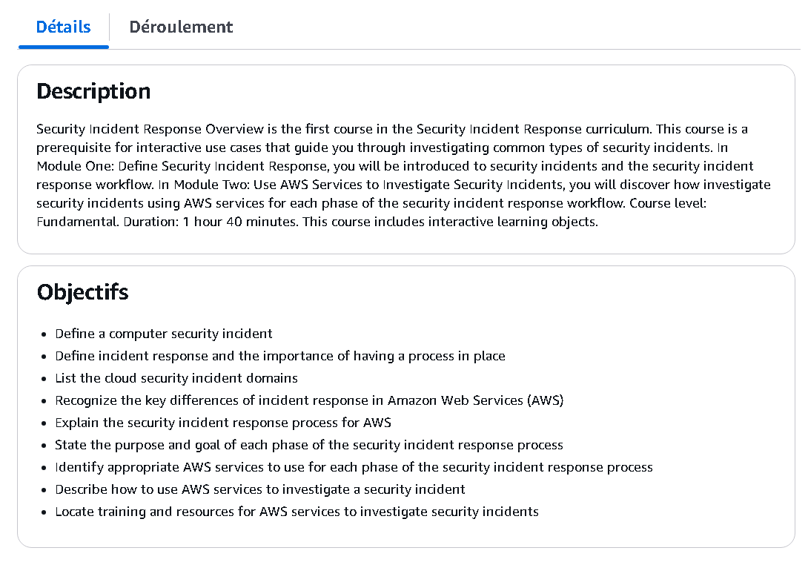
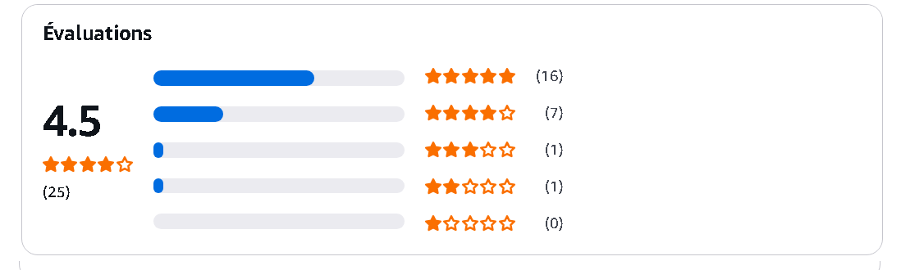

# 🛡️ AWS Security Incident Response – AWS Skill Builder

This repository documents key learnings, notes, demos, and forensic techniques from the **AWS Security Incident Response Overview** course on [AWS Skill Builder](https://explore.skillbuilder.aws/learn/course/external/view/elearning/13476/aws-security-incident-response-overview).

---

## 📚 Notes

All notes are stored in Markdown format for clean review and search:

- 📘 [`incident-response-phases.md`](./notes/incident-response-phases.md) – Detection, Containment, Eradication, Recovery  
- 🛡️ [`aws-security-principles.md`](./notes/aws-security-principles.md) – Shared responsibility, least privilege  
- 🔍 [`investigation-tools.md`](./notes/investigation-tools.md) – CloudTrail, GuardDuty, Config, Macie  
- 🚨 [`threat-detection-services.md`](./notes/threat-detection-services.md) – Overview of AWS native threat detection  
- 📖 [`postmortem-lessons.md`](./notes/postmortem-lessons.md) – Reporting, playbook feedback, stakeholder updates

---

## 🛠️ Demo

Realistic simulations based on AWS threat handling:

- 🧪 [`iam-breach-response.md`](./demo/iam-breach-response.md) – Handling compromised IAM access  
- 🔧 [`s3-public-access-misconfig.md`](./demo/s3-public-access-misconfig.md) – Simulating accidental S3 exposure

---

## 📊 Forensics

Advanced investigation and threat-hunting content:

- 🕵️ [`cloudtrail-forensics-guide.md`](./forensics/cloudtrail-forensics-guide.md) – Reconstructing activity from CloudTrail

---

## 🖼️ Screenshots

| Description                  | Screenshot |
|-----------------------------|------------|
| 📘 Course Modules Overview   |  |
| 📄 Description & Learning Obj |  |
| ✅ Final Review Page         |  |

---

## 📜 Certificate

- 🎓 [`AWS Security Incident Response Overview`](./cert/certificate-aws-skillbuilder.png)

---

## 📝 Course Review

This course delivers a solid introduction to incident response workflows within AWS. With cloud-native tooling like GuardDuty, CloudTrail, and AWS Config, the course emphasizes **automation**, **visibility**, and **response readiness**.

### ✅ What I Liked

- Modular, easy-to-follow structure  
- Practical examples of threats and AWS-native solutions  
- Good introduction to cloud-specific response workflows

### 📌 Areas to Improve

- Could expand more on third-party integrations (e.g., SOAR)  
- Limited real-time lab interaction (mostly theory)

---

## 🧭 Ideal For

- Cloud Security Beginners  
- Blue Team or DevSecOps members  
- Learners preparing for AWS Security Specialty or incident response roles

---

## ✍️ Author

**Thành Danh** – Pentester & Cybersecurity Researcher  
GitHub: [@ngvtdanhh](https://github.com/ngvtdanhh)  
Email: ngvu.thdanh@gmail.com

---

## 📄 License

This repository is licensed under the **GNU AGPL v3.0**.  
See [`LICENSE`](./LICENSE) for full details.

© 2025 ngvtdanhh. All rights reserved.
